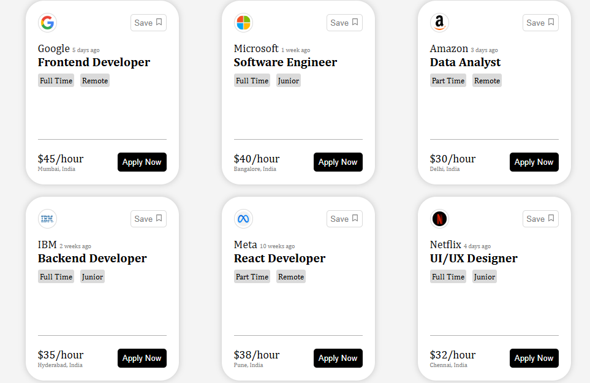

# Job Cards - React

A simple and responsive Job Cards UI built using React and Vite.

The project displays multiple job listings using reusable React components. Each job card contains company information, job title, employment type, work mode, salary, location, and company logo.

## Features

- Built with React and Vite
- Reusable `Card` component
- Job data stored in an array of objects
- Dynamic rendering using `.map()`
- Company logo and details
- Job type and work mode tags
- Salary and location information
- Clean and responsive UI

## Tech Stack

- React
- JavaScript
- HTML
- CSS
- Vite

## Project Structure

```text
project1/
│
├── src/
│   ├── components/
│   │   └── card.jsx
│   ├── App.jsx
│   ├── main.jsx
│   └── index.css
│
├── public/
│
├── .gitignore
├── index.html
├── package.json
├── package-lock.json
├── vite.config.js
└── README.md

## Preview

